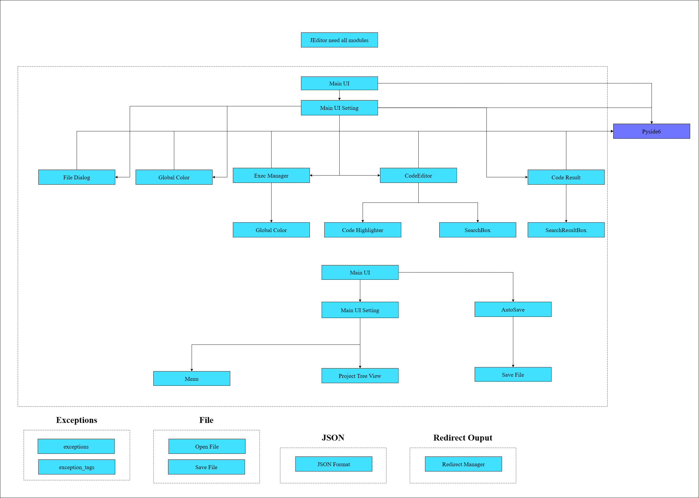

# je_editor

---

[](https://pepy.tech/project/je-editor)


[](https://www.codacy.com/gh/JE-Chen/je_editor/dashboard?utm_source=github.com&amp;utm_medium=referral&amp;utm_content=JE-Chen/je_editor&amp;utm_campaign=Badge_Grade)

[](https://github.com/Intergration-Automation-Testing/je_editor/actions/workflows/stable_python3_8.yml)

[](https://github.com/Intergration-Automation-Testing/je_editor/actions/workflows/stable_python3_9.yml)

[](https://github.com/Intergration-Automation-Testing/je_editor/actions/workflows/stable_python3_10.yml)

[](https://github.com/Intergration-Automation-Testing/je_editor/actions/workflows/stable_python3_11.yml)

### Document

[](https://je-editor.readthedocs.io/en/latest/?badge=latest)

---


> * Project Kanban https://github.com/orgs/Integration-Automation/projects/2/views/1
> * Modern Editor.
> * Old JEditor remake.
> * AutoSave, Encoding Feature.
> * Multi program and shell runner.
> * Including yapf python format checker.
> * Including reformat JSON.
> * Virtual Environment support. 
> * Dark & Light mode ui support.
> * File tree support.
> * Line code.
> * Current line highlight.
> * Python code highlight.
> * Performance efficiency than old JEditor 1000%.
> * OS Independent.


---

## Requires

```
python 3.8 or later
```

## install

```commandline
pip install je_editor
```

* Test on
    * windows 10 ~ 11
    * osx 10.5 ~ 11 big sur
    * ubuntu 20.0.4
    * raspberry pi 3B+

| All test in test dir

### Architecture Diagram
