# JEDITOR

<p align="center">
  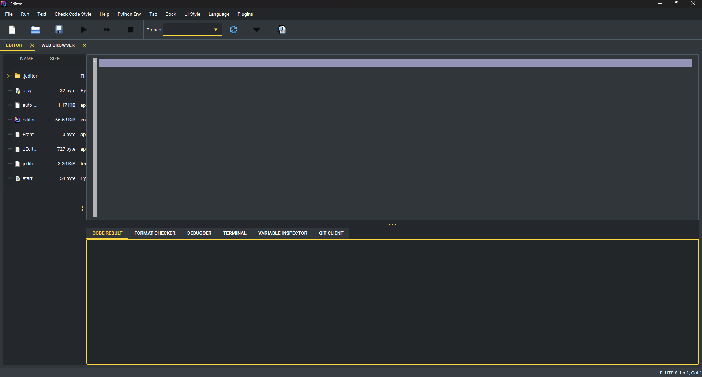
</p>

<p align="center">
  <strong>A modern, lightweight, and extensible code editor built with Python and PySide6.</strong>
</p>

<p align="center">
  <a href="https://github.com/JE-Chen/je_editor">
    
  </a>
  <a href="https://pypi.org/project/je_editor/">
    
  </a>
  <a href="https://pypi.org/project/je_editor/">
    
  </a>
  <a href="https://github.com/JE-Chen/je_editor/blob/main/LICENSE">
    
  </a>
  <a href="https://je-editor.readthedocs.io/en/latest/">
    
  </a>
</p>

<p align="center">
  <a href="README/README_zh-TW.md">繁體中文</a> |
  <a href="README/README_zh-CN.md">简体中文</a>
</p>

<p align="center">
  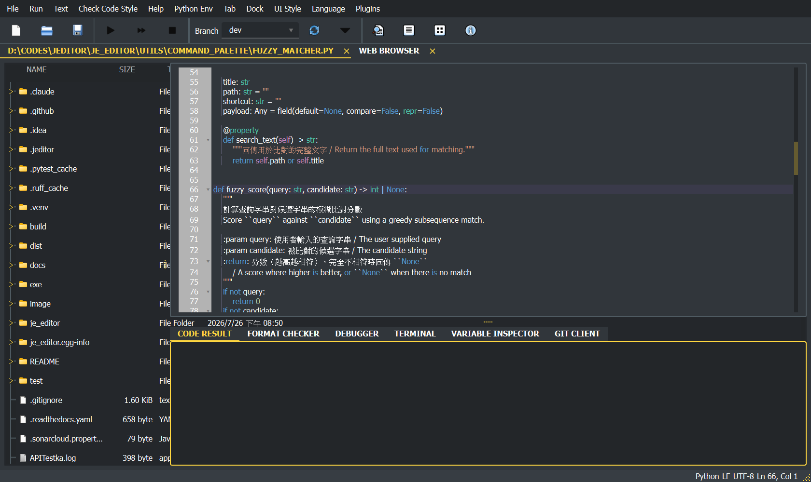
</p>

---

## Table of Contents

- [Introduction](#introduction)
- [Feature Tour](#feature-tour)
  - [Run your code and read the output](#run-your-code-and-read-the-output)
  - [Find anything without leaving the keyboard](#find-anything-without-leaving-the-keyboard)
  - [Linting as you type](#linting-as-you-type)
  - [Navigate the file you are in](#navigate-the-file-you-are-in)
  - [Run the tests and land on the failure](#run-the-tests-and-land-on-the-failure)
  - [Git, from the gutter to the whole repository](#git-from-the-gutter-to-the-whole-repository)
  - [Search and replace across the project](#search-and-replace-across-the-project)
  - [Read more of the file at once](#read-more-of-the-file-at-once)
  - [A terminal and a browser in the same window](#a-terminal-and-a-browser-in-the-same-window)
  - [Make it yours](#make-it-yours)
- [Key Features](#key-features)
- [System Requirements](#system-requirements)
- [Installation](#installation)
- [Quick Start](#quick-start)
- [Feature Details](#feature-details)
- [Keyboard Shortcuts](#keyboard-shortcuts)
- [Project Architecture](#project-architecture)
- [Plugin Development](#plugin-development)
- [Configuration](#configuration)
- [Documentation](#documentation)
- [Contributing](#contributing)
- [License](#license)

---

## Introduction

JEDITOR is a complete rewrite of the original JEditor project, rebuilt from the ground up with a
focus on **speed**, **usability**, and **extensibility**. Powered by **PySide6** (Qt for Python), it
delivers a modern desktop editing experience with syntax highlighting, auto-completion, an integrated
Git client, an AI assistant, an embedded browser, an IPython console, and a plugin system.

JEDITOR achieves up to **1000% faster performance** compared to the original JEditor while providing
a significantly richer feature set.

> Every screenshot below is a capture of the running application, not a mockup.

---

## Feature Tour

### Run your code and read the output

Press `F5` and the current file runs with the interpreter you selected; stdout and stderr stream back
into the **Code Result** pane as they arrive, with errors in red. `Shift+F5` stops it, and the
Debugger, Terminal, Variable Inspector and Git panes sit beside it as tabs.

<p align="center">
  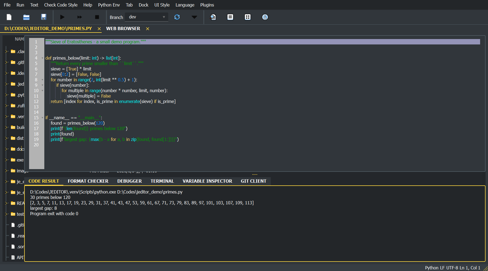
</p>

### Find anything without leaving the keyboard

`Ctrl+Shift+A` fuzzy-searches every menu command by name or menu path, ranked by word boundaries,
consecutive characters and prefixes, and shows each command's own shortcut on the right.

<p align="center">
  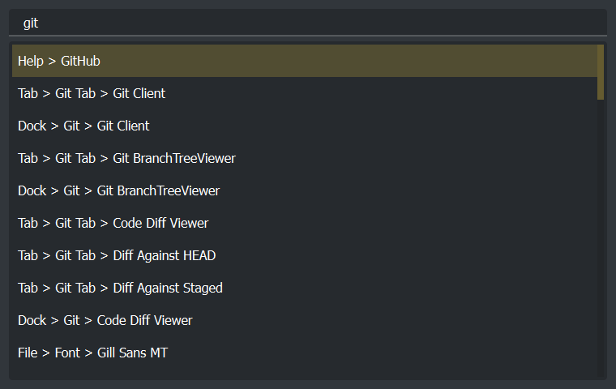
</p>

`Ctrl+P` does the same for files. Indexing runs on a background thread, skipping VCS, cache,
virtualenv and build directories along with binary file types; typing `>` at the start switches the
same picker back into command mode.

<p align="center">
  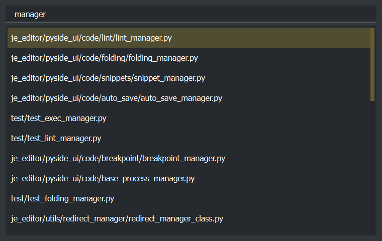
</p>

### Linting as you type

`ruff` runs on the **buffer** rather than the file on disk, on a worker thread once typing pauses, so
unsaved edits are covered and a stale result from a superseded run is discarded. Findings are
underlined in place and listed in the Problems panel, where **Apply Fixes** applies everything ruff
can fix by itself.

<p align="center">
  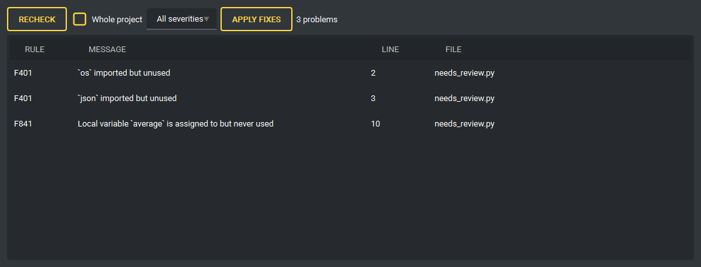
</p>

<p align="center">
  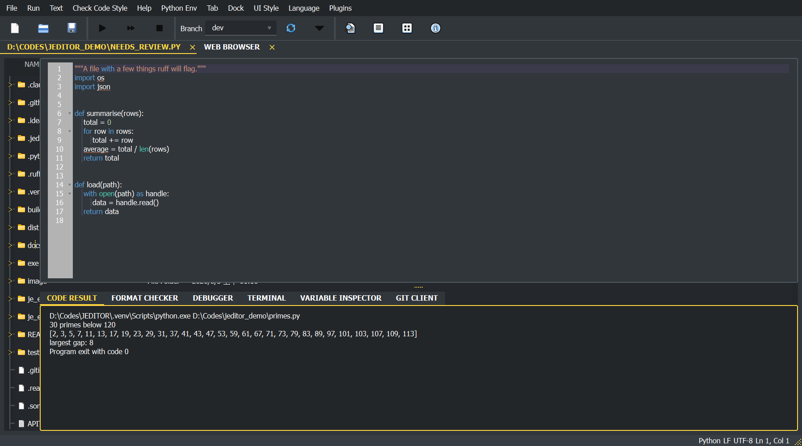
</p>

### Navigate the file you are in

The Outline panel lists the current file's classes, methods, functions and module variables. Python
is parsed with `ast`, so no code runs; other languages are asked of their language server, which
means a TypeScript or Rust file gets an outline too.

<p align="center">
  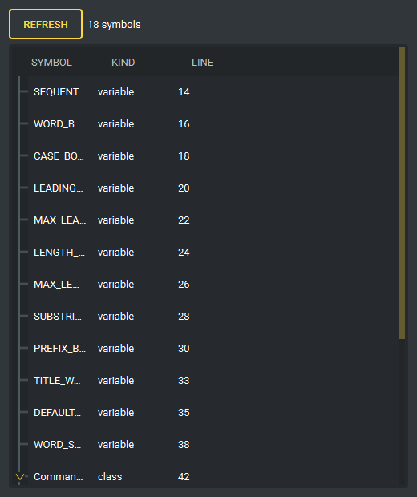
</p>

The TODO panel scans the whole project for `TODO`, `FIXME`, `HACK`, `XXX`, `BUG`, `NOTE` and
`OPTIMIZE` comments across Python, C-like, HTML, SQL and other comment styles. Tags are only reported
when they follow a comment marker, so ordinary strings are never misreported.

<p align="center">
  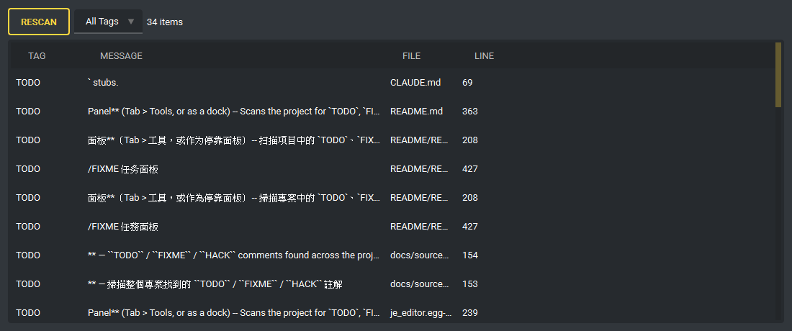
</p>

### Run the tests and land on the failure

Run pytest from a panel and read the results with failures first. Selecting a failing test shows its
traceback below the list, double-clicking opens that test at the failing line, and you can re-run
everything, only the selection, or only what failed last time. Ticking **With coverage** adds the
total beside the summary.

<p align="center">
  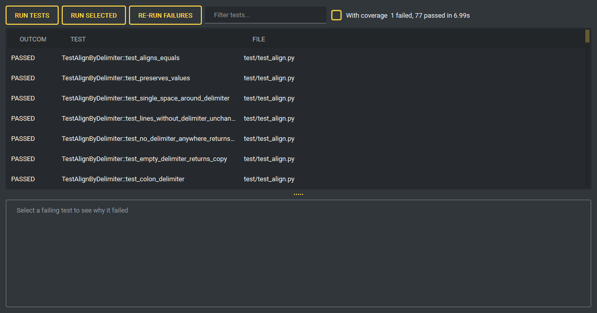
</p>

### Git, from the gutter to the whole repository

The gutter shows how the file differs from its last commit — green for added lines, orange for
modified, a thin red line where lines were deleted. `F7` / `Shift+F7` jump between changes,
`Ctrl+Alt+Z` reverts the one under the caret in a single undo step, and the right-click menu stages
just that change. `Ctrl+Alt+B` toggles inline blame. The committed version is read on a background
thread and the comparison is a pure in-memory diff, so editing never waits on git.

The full client handles branches, staging, commits, stash, conflicts, clone and push:

<p align="center">
  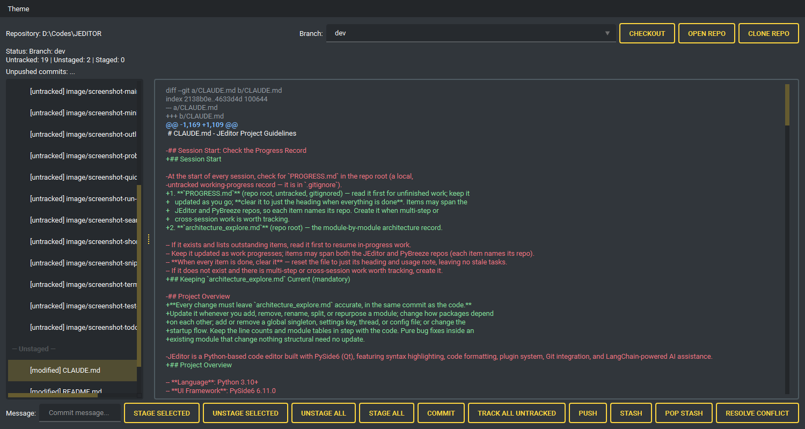
</p>

Any change can be opened as a side-by-side comparison, against `HEAD` or against what is staged:

<p align="center">
  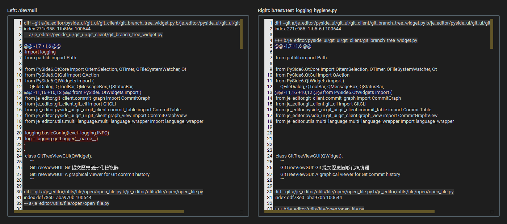
</p>

### Search and replace across the project

Search the current file, a folder, or the whole project, with regex and case options. Long searches
run on a worker thread so the window stays responsive, and double-clicking a hit opens that file at
that line.

<p align="center">
  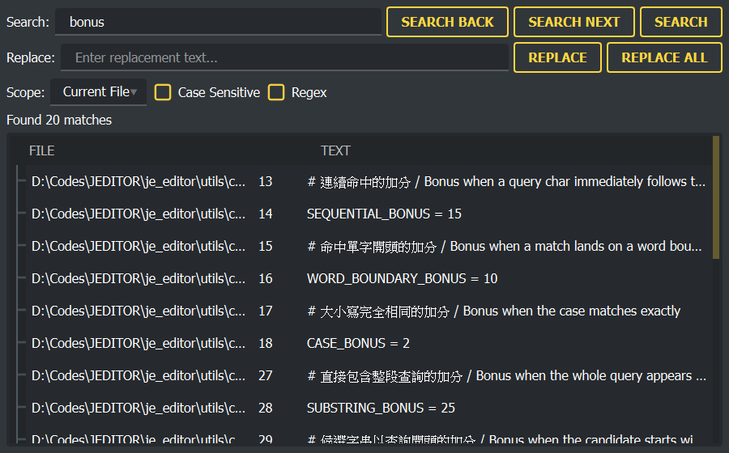
</p>

### Read more of the file at once

`Ctrl+Alt+M` opens a minimap of the whole file, drawn as bars following each line's length and
indentation, with marks for lint diagnostics, git changes and search hits. `Ctrl+Alt+\` splits the
view: both halves share one document, so an edit on either side appears in the other at once, while
scrolling and the caret stay independent.

<p align="center">
  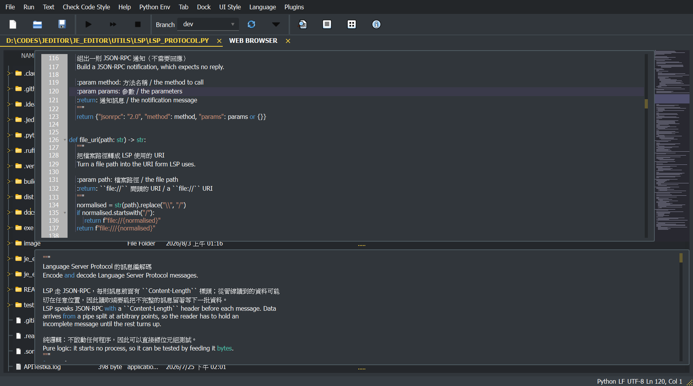
</p>

### A terminal and a browser in the same window

The Terminal tab is a real interactive shell (cmd, PowerShell, bash or sh) with command history and
its own working directory.

<p align="center">
  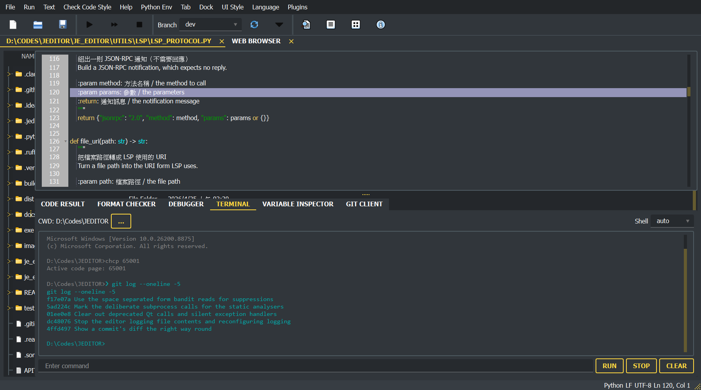
</p>

The browser tab keeps documentation and Stack Overflow one click away, with tabs, an address bar and
in-page search.

<p align="center">
  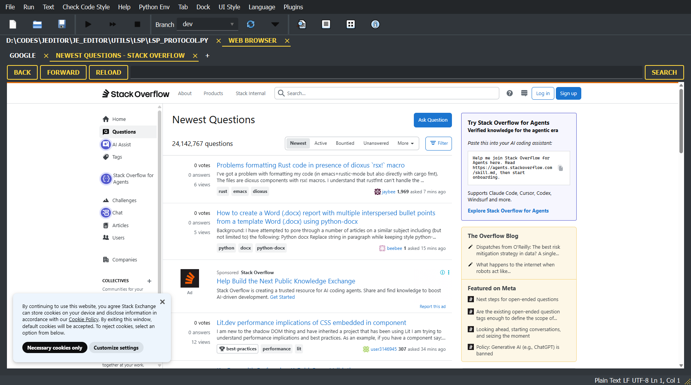
</p>

### Make it yours

Every command's keys are listed in one editable table. Two commands claiming the same keys cannot be
saved, because Qt runs neither of them when that happens; a change takes effect immediately, and only
what differs from a default is stored.

<p align="center">
  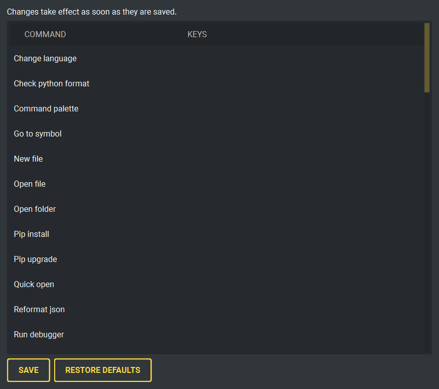
</p>

Snippets use the usual `$1` / `${2:default}` / `$0` notation, with per-language sets on top of the
shared ones, edited from **Tab > Edit Snippets** rather than by hand.

<p align="center">
  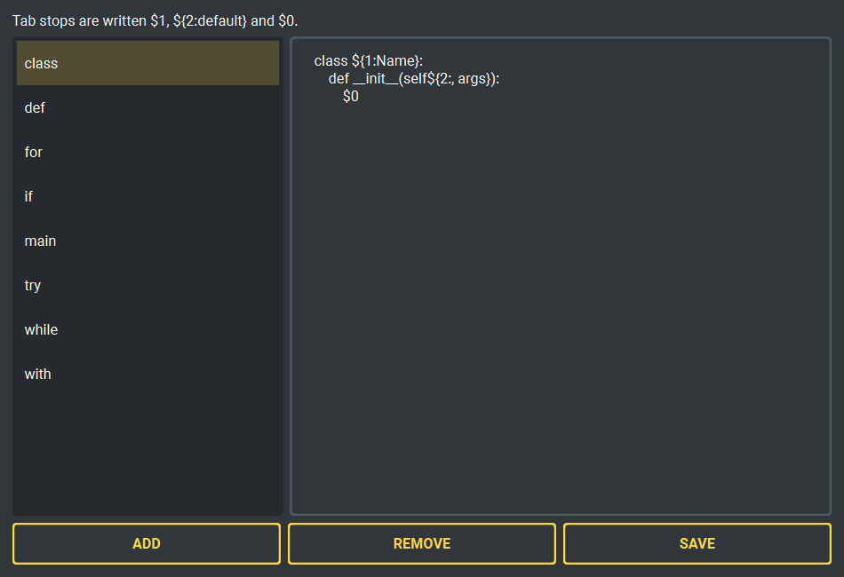
</p>

Themes come from Qt Material, and the editor's own colours follow whichever one you pick — a light
window never leaves you with dark-theme syntax colours.

<p align="center">
  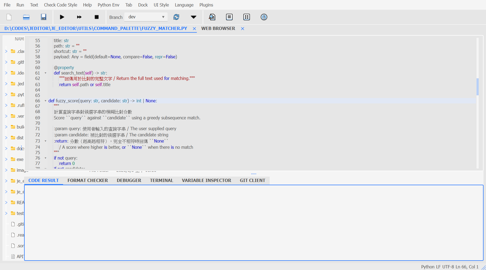
</p>

---

## Key Features

| Category | Features |
|---|---|
| **Editor** | Multi-tab editing, syntax highlighting for twelve languages, auto-completion (Jedi and language servers), multiple carets with selections, snippets with mirrored placeholders, split view, minimap, code folding (indentation and braces), bookmarks, occurrence highlighting, line operations |
| **Navigation** | Command palette, quick open (go to file), go to symbol, document outline, navigation history (back/forward), TODO/FIXME task panel |
| **Execution** | Run Python scripts (F5), debug mode (F9), shell commands, virtual environment detection |
| **Code Quality** | YAPF formatting, format on save, PEP8 checking, Ruff linting with a problems panel, language-server diagnostics and quick fixes, pytest panel with tracebacks and coverage, JSON reformatting |
| **Git** | Branch management, commit history, side-by-side diff viewer, gutter change markers, per-change staging and revert, inline blame, stash, conflict resolution, audit logging |
| **AI** | OpenAI GPT integration via LangChain, interactive chat widget, configurable models & prompts |
| **Console** | Interactive shell, Jupyter/IPython console, command history, multi-shell support |
| **Browser** | Embedded web browser, URL navigation, in-page search |
| **Plugins** | Custom syntax highlighting, UI translations, run configurations, auto-discovery |
| **UI** | Dark/light themes (Qt Material) with matching editor colours, configurable keyboard shortcuts, font customization, dockable panels, system tray, toolbar, status bar |
| **i18n** | English, Traditional Chinese, Simplified Chinese, Japanese; follows the system language, switches without restarting, extensible via plugins |
| **Files** | Auto-save, multi-encoding support (UTF-8, GBK, Latin-1, etc.), recent files, multi-file session restore |

---

## System Requirements

| Platform | Version |
|---|---|
| **Windows** | Windows 10 / 11 |
| **macOS** | 10.5 ~ 11 Big Sur |
| **Linux** | Ubuntu 20.04+ |
| **Raspberry Pi** | 3B+ |
| **Python** | 3.10+ (tested on 3.10, 3.11, 3.12) |

---

## Installation

### From PyPI (Recommended)

```bash
pip install je_editor
```

### From Source

```bash
git clone https://github.com/JE-Chen/je_editor.git
cd je_editor
pip install .
```

### Dependencies

Core dependencies are installed automatically:

| Package | Purpose |
|---|---|
| PySide6 | GUI framework (Qt for Python) |
| qt-material | Dark/light material themes |
| yapf | Python code formatting (Google style) |
| jedi | Python auto-completion & analysis |
| ruff | Fast Python linter |
| gitpython | Git repository operations |
| langchain_openai + langchain_core | AI/LLM integration |
| watchdog | File system monitoring |
| pycodestyle | PEP8 style checking |
| qtconsole | Jupyter/IPython console widget |

---

## Quick Start

### Launch the Editor

```bash
python -m je_editor
```

### Use as a Python Library

```python
from je_editor import start_editor

start_editor()
```

The editor launches maximized with a dark amber theme by default.

---

## Feature Details

### Code Editing

- **Multi-tab editor** -- Work on multiple files simultaneously with closable tabs.
- **Syntax highlighting** -- Built-in Python highlighting with extensible plugin support for additional languages.
- **Auto-completion** -- Context-aware code suggestions powered by Jedi.
- **Line numbers** -- Displayed alongside the editor with current line highlighting.
- **Search & Replace** -- Search within the current file, across folders, or project-wide with regex and case-sensitive options. Runs in background threads for large projects.
- **Code Folding** -- Collapse and expand blocks from the gutter fold triangles or the keyboard. Python and other indented files fold on indentation; the C-family languages (JavaScript, TypeScript, Rust, Go, C/C++, Java, JSON) fold on brace pairs instead, so a brace on its own line still opens a region. Braces inside strings and comments are skipped, since one in a string would throw every pair after it out of step. Folding only toggles line visibility -- it never modifies the text, so saving always writes the complete file. Folds self-heal after edits: a fold whose header no longer exists simply reopens instead of hiding the wrong lines.
- **Bookmarks** -- Mark lines and jump between them with the keyboard, or click the gutter to toggle. Bookmarks are anchored to the text (via `QTextCursor`), so they follow their code when lines are inserted or removed above them instead of drifting.
- **Multiple Carets** -- `Ctrl+Shift+L` puts a caret at the end of every selected line, `Ctrl+Alt+N` adds one at the next occurrence of the word under the caret, `Ctrl+Alt+Shift+Up` / `Down` adds one on the line above or below, and `Alt`-click adds or removes one anywhere. All of them move together with the arrow keys, Home and End, and `Shift` with any of those extends a selection at every caret. Typing, Backspace and Delete apply at all of them as a single undo step, replacing each selection where there is one; `Ctrl+Shift+Esc` or a plain click returns to one caret.
- **Split View** (`Ctrl+Alt+\`) -- A second view of the same file, sharing one document: an edit in either side shows up in the other at once, while scrolling and the caret stay independent.
- **Minimap** (`Ctrl+Alt+M`) -- An overview of the whole file drawn as bars following each line's length and indentation, with a band marking what is on screen. Marks down the sides show lint diagnostics, git changes, and whatever you are currently looking for -- the search box's hits while a search is open, and otherwise the other occurrences of the word under the caret. Click or drag to jump. Large files are sampled rather than drawn line by line.
- **Snippets** -- Type a trigger word and press Tab to expand it, then Tab through the placeholders with each default value selected. A placeholder used more than once only has to be typed once: the repeats follow as you type. Uses the usual `$1` / `${2:default}` / `$0` notation, so existing snippets drop straight into `snippets.json`, and there are per-language sets on top of the shared ones. Edit them from Tab > Edit Snippets rather than by hand; a missing or broken file falls back to the built-in Python set.
- **Test Panel** -- Run pytest from a dock panel and read the results, failures first, with the summary as the status line. Selecting a failure shows its traceback in a pane below the list, and a coverage box adds the total beside the summary (which needs `pytest-cov` in the project being tested). Run everything, only the selection, or only what failed last time; double-click a row to open that test at the failing line.
- **Language Server Support** -- Non-Python files get completion, hover, go-to-definition, rename, formatting, signature help, find-references, quick fixes and document symbols from a language server over stdio (TypeScript, Rust, Go, C/C++, Lua, JSON and more, configurable per suffix), while Python keeps using jedi. One server is shared by every tab that needs it, keyed by command and project root, rather than one process per open file. Diagnostics appear in the same underlines and Problems panel as ruff's. A server that is not installed simply means no completions rather than an error.
- **Encoding & Line Endings** -- A file's encoding and line-ending style are detected when it opens and written back unchanged when it saves, so editing one line of a CRLF file no longer rewrites every line. Both can be changed from the File menu; changing the encoding re-reads an unmodified file so mojibake can be fixed in place, and never discards unsaved work.
- **Format on Save** -- Optionally run yapf when a file is saved, keeping the caret on its line. Source that cannot be parsed is left alone rather than blocking the save.
- **Indent Guides & Trailing Whitespace** -- A vertical guide at each indentation level and shading on stray end-of-line whitespace, both toggleable from the Style menu.
- **Lint Diagnostics** -- Findings from `ruff` are underlined in the editor and listed in a Problems dock panel (rule, message, line), with double-click to jump. The **buffer** is checked, not the file on disk, so unsaved edits are covered; the run happens on a worker thread after typing pauses, and a stale result from a superseded run is discarded. If `ruff` is not installed, or a run fails, the editor simply shows no diagnostics rather than reporting an error.
- **Git Change Markers** -- The gutter shows how the file differs from its last commit: a green bar for added lines, orange for modified, and a thin red line where lines were deleted. Jump between changes with `F7` / `Shift+F7`, revert the change under the caret back to its committed form with `Ctrl+Alt+Z` (one undo step), and stage just that change from the right-click menu. `Ctrl+Alt+B` toggles inline blame, showing the commit, author and summary that last touched each line. The Git menu opens a side-by-side diff of the whole file against HEAD, or against what is staged -- after staging change by change, that second one is what shows which parts actually went into the index. The right-click menu also unstages the file and commits what is staged. The committed version is read on a background thread when the file opens, and the comparison itself is a pure in-memory diff, recomputed only after typing pauses -- so editing never waits on git. Files outside a repository, or not yet committed, simply show no markers.
- **Occurrence Highlighting** -- Placing the caret on an identifier highlights every other whole-word occurrence of it in the file. Keywords and single characters are ignored, and the scan is skipped on very large files to keep caret movement instant.
- **Line Operations** -- Delete the current line or selection (`Ctrl+Shift+D`), sort selected lines (`Ctrl+Alt+S`), join selected lines into one (`Ctrl+Shift+J`), and (from the Text menu) natural sort, remove duplicate lines, remove blank lines, reverse line order, or align lines on a delimiter (e.g. `=`). Each is a single undo step.
- **Duplicate** (`Ctrl+D`) -- Duplicates the selection when there is one (selecting the new copy), or the whole line when there isn't.
- **Smart Selection** -- Expand the selection outward through word → line → enclosing indented blocks → whole file (`Ctrl+Alt+Right`), and shrink it back (`Ctrl+Alt+Left`). Shrinking only retraces expansions, and a manual selection change resets the history.
- **Increment / Decrement Number** -- Bump the integer under the caret up or down (`Ctrl+Alt+Up` / `Ctrl+Alt+Down`), handling negative signs and growing widths.
- **Rename in File** (`F2`) -- Rename every whole-word occurrence of the identifier under the caret across the file as a single undo step. Word boundaries protect partial matches (renaming `val` never touches `value`).
- **Navigation History** -- Jump back and forward through your cursor-jump history like a browser (`Alt+Left` / `Alt+Right`). A jump records both where you came from and where you went, so "back" returns to where you started.
- **Document Outline** -- A dockable tree of the current file's classes, methods, functions and module variables. Python is parsed with `ast`, so no code runs; other languages are asked of their language server, so a TypeScript or Rust file gets an outline too. Double-click to jump to a definition.
- **Keyboard Shortcuts** (Style > Keyboard Shortcuts) -- Every command's keys in one list, editable. Two commands claiming the same keys cannot be saved, because Qt runs neither of them when that happens; a change takes effect immediately, and only what differs from a default is stored.
- **Variable Inspector** -- Inspect and debug variables during code execution.

### Navigation

- **Command Palette** (Ctrl+Shift+A) -- Fuzzy-search every menu command by name or menu path and run it without hunting through menus. Matches are ranked by word boundaries, consecutive characters and prefixes, and each row shows the command's own keyboard shortcut.
- **Quick Open / Go to File** (Ctrl+P) -- Fuzzy-search the project tree by file name *or* folder path. Indexing runs in a background thread, skipping VCS, cache, virtualenv and build directories along with binary file types. Typing `>` at the start switches the same picker into command mode.
- **Go to Symbol** (Ctrl+Shift+O) -- Jump to any class, function, method or module-level variable in the current Python file. Symbols are parsed with the standard library `ast` module, so no user code is ever executed, and a file that does not parse simply yields no symbols instead of erroring while you type.
- **TODO Panel** (Tab > Tools, or as a dock) -- Scans the project for `TODO`, `FIXME`, `HACK`, `XXX`, `BUG`, `NOTE` and `OPTIMIZE` comments across Python, C-like, HTML, SQL and other comment styles. Filter by tag and double-click a row to open that file at that line. Tags are only reported when they follow a comment marker, so ordinary strings are not misreported.

### Code Execution & Debugging

- **Run Python scripts** (F5) -- Execute the current file with real-time output streaming.
- **Debug mode** (F9) -- Launch the Python debugger for step-through debugging, with breakpoints toggled from the gutter (`Ctrl+F9`).
- **Shell commands** -- Execute arbitrary shell/terminal commands from within the editor.
- **Virtual environment detection** -- Automatically detects and activates Python virtual environments.
- **Process management** -- Stop individual or all running processes.
- **Error highlighting** -- Errors displayed in red in the output panel.

### Code Quality & Formatting

- **YAPF Python formatting** (Ctrl+Shift+Y) -- Automatically format Python code using Google style.
- **PEP8 checking** (Ctrl+Alt+P) -- Validate code against PEP8 style guidelines.
- **Ruff linting** -- Fast, comprehensive Python linting in a background thread.
- **JSON reformatting** (Ctrl+J) -- Pretty-print and validate JSON content.
- **Trim Trailing Whitespace** (Text menu) -- Strip trailing whitespace from every line as one undo step, preserving the caret position.
- **Convert Indentation** (Text menu) -- Convert leading indentation between tabs and spaces (using your indent size). Only leading whitespace is touched, so tabs and spaces inside strings are never altered.
- **Configurable indent width** -- Tab-indent, unindent and Enter auto-indent all honour the configured indent size (`Text > Indent Size`), and the indent width is auto-detected from a file's own content when it is opened.
- **Text transforms** (Text menu) -- Case conversion (upper / lower / swap / title), naming-style conversion (`snake_case` / `camelCase` / `PascalCase` / `kebab-case`), number-base conversion (hex / decimal / binary), and encode/decode helpers (Base64, URL, HTML entities, JSON string escaping). Decoders that fail leave the text untouched.
- **Statistics** (Text menu) -- Line, word and character counts for the whole document or the current selection.

### File Operations

- **Create, open, save** files with standard shortcuts (Ctrl+N, Ctrl+O, Ctrl+S).
- **Open folders** (Ctrl+K) -- Navigate project directory structures.
- **Auto-save** -- Automatic periodic file saving to prevent data loss.
- **Session restore** -- Reopens every file that was open at the last shutdown, not just the last one. Missing, duplicate and already-open files are skipped, the list is capped, and a corrupt or hand-edited settings file can never block startup. Disable by setting `restore_session` to `false` in `.jeditor/user_setting.json`.
- **Multi-encoding** -- Seamlessly handle UTF-8, GBK, Latin-1, and other encodings with automatic detection.
- **Recent files** -- Quick access to previously opened files.

### Git Integration

- **Branch management** -- List, switch, and checkout branches from the toolbar.
- **Commit history** -- View commit metadata (author, date, message) in a table, with a lane-coloured commit graph.
- **Side-by-side diff viewer** -- Colour-highlighted comparison with line numbers, against `HEAD` or the index.
- **Multi-file diff** -- Compare changes across multiple files, one tab per file.
- **Staging** -- Stage and unstage whole files, or one change at a time from the editor's gutter.
- **Stash** -- Put the current changes away, list what is stashed, and take one back.
- **Conflict resolution** -- List the files left in conflict after a merge and settle one by keeping either side.
- **Audit logging** -- Git operations are logged for tracking and compliance.

### AI Assistant

- **OpenAI models via LangChain** -- Connect to OpenAI's language models.
- **Interactive chat widget** -- Conversational AI panel within the editor.
- **Configurable models** -- Set custom API keys, endpoints, model names, and system prompts.
- **Async messaging** -- Non-blocking AI interaction using a message queue.

### Console & REPL

- **Interactive console** -- Execute shell commands with history navigation (Up/Down arrows).
- **Jupyter/IPython console** -- In-process IPython kernel with rich output support.
- **Multi-shell support** -- Works with cmd, PowerShell, bash, and sh.
- **Working directory control** -- Set the execution directory independently.

### Embedded Browser

- **Built-in web browser** -- Browse the web without leaving the editor.
- **URL navigation** -- Address bar with integrated search.
- **In-page search** (Ctrl+F) -- Find text within web pages.
- **Standard navigation** -- Back, forward, reload, and stop controls.

### Plugin System

| Type | Purpose |
|---|---|
| Programming Language | Add syntax highlighting for new languages |
| Natural Language | Add UI translations for new locales |
| Run Configuration | Define custom execution environments |
| Plugin Metadata | Provide plugin version and author info |

Plugins are discovered automatically from the `jeditor_plugins/` directory, and can also be browsed
and installed from within the editor. See [Plugin Development](#plugin-development).

### Theming & Customization

- **Dark/Light themes** -- Qt Material themes; the editor's own colours follow the window style.
- **Font customization** -- Change font family and size for the editor and UI independently.
- **Dockable panels** -- Rearrange the UI layout by docking/undocking panels.
- **System tray** -- Minimize the editor to the system tray.
- **Toolbar** -- JetBrains-style quick action buttons, including the current Git branch.

### Multi-Language UI

- **English**, **Traditional Chinese** (繁體中文), **Simplified Chinese** (简体中文) and **Japanese** (日本語) -- each complete. Simplified Chinese is written in mainland vocabulary rather than converted from the traditional text, where 檔案/文件, 資料夾/文件夹 and 程式/程序 all differ.
- **Follows the system on a first run** -- the language is taken from the system locale rather than defaulting to English, with Chinese resolved by script: `zh-Hant` and the Taiwan, Hong Kong and Macau regions get traditional characters, and anything else simplified. What is detected is recorded, so from then on it is simply the chosen language.
- **Changes without restarting** -- picking a language relabels the menus, toolbar, panels, tabs and status bar at once. File and branch names on tabs are left alone.
- **Falls back to English** -- a key a language has not translated shows the English text rather than a blank label, so a language can be added before it is finished.
- **Extensible** -- add new languages via the plugin system. Locale rules for Korean, Spanish, French, German, Russian and Portuguese are already in place; each needs only its dictionary.

---

## Keyboard Shortcuts

| Shortcut | Action |
|---|---|
| `Ctrl+N` | New file |
| `Ctrl+O` | Open file |
| `Ctrl+K` | Open folder |
| `Ctrl+S` | Save file |
| `Ctrl+Shift+S` | Save every modified tab |
| `Ctrl+Shift+A` | Command palette |
| `Ctrl+P` | Quick open (go to file) |
| `Ctrl+Shift+O` | Go to symbol |
| `Ctrl+Shift+[` | Toggle fold at cursor |
| `Ctrl+Alt+[` | Fold all |
| `Ctrl+Alt+]` | Unfold all |
| `Ctrl+Alt+K` | Toggle bookmark |
| `Ctrl+Alt+L` | Next bookmark |
| `Ctrl+Alt+J` | Previous bookmark |
| `Alt+Left` | Navigate back |
| `Alt+Right` | Navigate forward |
| `Ctrl+Shift+D` | Delete current line / selection |
| `Ctrl+Alt+S` | Sort selected lines |
| `Ctrl+Shift+J` | Join selected lines |
| `Ctrl+Alt+Right` | Expand selection |
| `Ctrl+Alt+Left` | Shrink selection |
| `Ctrl+Alt+Up` | Increment number under caret |
| `Ctrl+Alt+Down` | Decrement number under caret |
| `F2` | Rename occurrences in file |
| `Ctrl+Shift+L` | Caret at the end of every selected line |
| `Ctrl+Alt+N` | Add caret at next occurrence |
| `Ctrl+Alt+Shift+Up` / `Ctrl+Alt+Shift+Down` | Add caret above / below |
| `Ctrl+Shift+Esc` | Back to a single caret |
| `Ctrl+Shift+R` | Start / stop macro recording |
| `Ctrl+Shift+G` | Play macro |
| `Ctrl+Alt+E` | Recent locations |
| `Ctrl+Alt+\` | Toggle split view |
| `Ctrl+Alt+M` | Toggle minimap |
| `F7` / `Shift+F7` | Next / previous change |
| `Ctrl+Alt+Z` | Revert the change at the caret |
| `Ctrl+Alt+B` | Toggle inline blame |
| `Ctrl+J` | Reformat JSON |
| `Ctrl+Shift+Y` | YAPF Python format |
| `Ctrl+Alt+P` | PEP8 format checker |
| `Ctrl+F` | Find text (editor, browser) |
| `Ctrl+Shift+F` | Search across files |
| `Alt+W` | Word wrap |
| `Ctrl+Shift+P` | Install a package with pip |
| `Ctrl+Shift+U` | Upgrade and install packages |
| `Ctrl+Shift+V` | Change the Python interpreter |
| `Ctrl+H` | Find and replace |
| `Ctrl+G` | Go to line |
| `F5` | Run program |
| `F9` | Debug |
| `Shift+F5` | Stop program |
| `Ctrl+F9` | Toggle breakpoint |
| `Ctrl+F5` | Debugger: continue |
| `F10` / `F11` / `Shift+F11` | Debugger: step over / into / out |
| `Up/Down` | Command history (console) |

Every shortcut above can be reassigned from **Style > Keyboard Shortcuts**. The keys below are
handled by the editing area itself, so they are fixed:

| Shortcut | Action |
|---|---|
| `Ctrl+D` | Duplicate line / selection |
| `Ctrl+/` | Toggle comment |
| `Alt+Up` / `Alt+Down` | Move line up / down |
| `Ctrl+B` | Jump to the definition under the caret |
| `Ctrl+Shift+\` | Jump to the matching bracket |
| `Ctrl++` / `Ctrl+-` | Zoom the editor font in / out |
| `Tab` / `Shift+Tab` | Indent / unindent the line or selection |

---

## Project Architecture

```
je_editor/
├── pyside_ui/          GUI layer (PySide6)
│   ├── browser/        Embedded web browser
│   ├── code/           The editor itself: syntax, folding, lint, LSP, git markers,
│   │                   multiple carets, snippets, minimap, process execution
│   ├── dialog/         Search & replace, shortcuts, snippets, file dialogs
│   ├── git_ui/         Git client, commit graph, diff viewers
│   └── main_ui/        Main window, menus, toolbar, panels, settings, AI, console
├── code_scan/          Ruff execution and watchdog file monitoring
├── git_client/         Git operations (GitPython + git CLI)
├── plugins/            Plugin registry and loader
└── utils/              Pure logic, no Qt: diffing, folding, fuzzy matching, symbols,
                        LSP protocol, encodings, shortcuts, translations
```

Features are built in two halves: the algorithm lives in `utils/` with no Qt import, and a thin
manager in `pyside_ui/` wires it to widgets. Folding, for example, is `utils/code_folding/` plus
`pyside_ui/code/folding/`. That is why most of the behaviour above can be tested without opening a
window.

A module-by-module reference — what every file does, the threading model, the global singletons and
the settings layout — is kept in **[`architecture_explore.md`](architecture_explore.md)**.

---

## Plugin Development

Create plugins in a `jeditor_plugins/` directory inside your working directory. Each plugin is a
Python module that registers what it provides on import.

### 1. Programming Language Plugin

Add syntax highlighting for a new language:

```python
from je_editor.plugins import register_programming_language

register_programming_language(
    suffix=".rs",
    syntax_words={"keywords": ["fn", "let", "mut", "struct", "impl", "enum"]},
    syntax_rules={"keyword_color": "#FF6600"},
)
```

### 2. Natural Language Plugin

Add a new UI translation:

```python
from je_editor.plugins import register_natural_language

register_natural_language(
    language_key="ja",
    display_name="Japanese",
    word_dict={"file": "ファイル", "edit": "編集", "run": "実行"},
)
```

### 3. Run Configuration Plugin

Teach the **Run with...** menu how to run another language. Interpreted languages just need a
compiler and its arguments:

```python
from je_editor.plugins import register_plugin_run_config

register_plugin_run_config({
    "name": "Go",             # shown in the menu
    "suffixes": (".go",),     # file types this applies to
    "compiler": "go",         # executable
    "args": ("run",),         # arguments before the file path
})
# runs: go run file.go
```

Compiled languages add `compile_then_run` and the flag that names the output binary:

```python
register_plugin_run_config({
    "name": "C (GCC)",
    "suffixes": (".c",),
    "compiler": "gcc",
    "args": (),
    "compile_then_run": True,
    "output_flag": "-o",
})
# compiles: gcc file.c -o file    then runs the result
```

For the full guide, including plugin metadata and packaging, see
[`PLUGIN_GUIDE.md`](PLUGIN_GUIDE.md).

---

## Configuration

JEDITOR stores user settings in a `.jeditor/` directory inside the working directory:

| File | Content |
|---|---|
| `user_setting.json` | General preferences (font, theme, language, recent files, open tabs, reassigned shortcuts) |
| `user_color_setting.json` | Editor and output colours, including syntax highlighting |
| `snippets.json` | Your own snippets, merged over the built-in sets |
| `ai_config.json` | AI assistant settings — read at startup, never written; create it yourself |

Each file is backed up to `<name>.bak` before it is rewritten.

---

## Documentation

Full documentation is available at
**[https://je-editor.readthedocs.io/en/latest/](https://je-editor.readthedocs.io/en/latest/)**.

---

## Contributing

Contributions are welcome. Please feel free to submit issues and pull requests on
[GitHub](https://github.com/JE-Chen/je_editor).

---

## License

This project is licensed under the **MIT License**. See [LICENSE](LICENSE) for details.

Copyright (c) 2021 ~ Now JE-Chen
