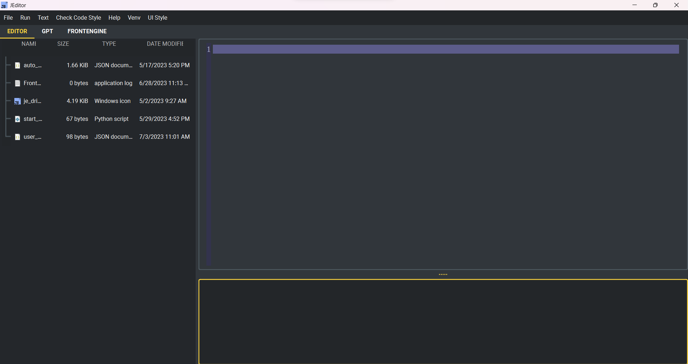

# JEDITOR

<p align="center">
  
</p>

<p align="center">
  <strong>一款基于 Python 与 PySide6 打造的现代化、轻量级、可扩展代码编辑器。</strong>
</p>

<p align="center">
  <a href="https://github.com/JE-Chen/je_editor">
    
  </a>
  <a href="https://pypi.org/project/je_editor/">
    
  </a>
  <a href="https://pypi.org/project/je_editor/">
    
  </a>
  <a href="https://github.com/JE-Chen/je_editor/blob/main/LICENSE">
    
  </a>
</p>

<p align="center">
  <a href="../README.md">English</a> |
  <a href="README_zh-TW.md">繁體中文</a>
</p>

---

## 目录

- [简介](#简介)
- [主要特性](#主要特性)
- [截图展示](#截图展示)
- [系统要求](#系统要求)
- [安装方式](#安装方式)
- [快速开始](#快速开始)
- [功能详情](#功能详情)
  - [代码编辑](#代码编辑)
  - [程序执行与调试](#程序执行与调试)
  - [代码质量与格式化](#代码质量与格式化)
  - [文件操作](#文件操作)
  - [Git 集成](#git-集成)
  - [AI 助手](#ai-助手)
  - [控制台与 REPL](#控制台与-repl)
  - [内置浏览器](#内置浏览器)
  - [插件系统](#插件系统)
  - [主题与自定义](#主题与自定义)
  - [多语言界面](#多语言界面)
- [键盘快捷键](#键盘快捷键)
- [项目架构](#项目架构)
- [插件开发](#插件开发)
- [配置文件](#配置文件)
- [文档](#文档)
- [参与贡献](#参与贡献)
- [许可证](#许可证)

---

## 简介

JEDITOR 是原始 JEditor 项目的完全重写版本，从零开始重新打造，专注于**速度**、**易用性**与**可扩展性**。以 **PySide6**（Qt for Python）为基础，提供现代化的桌面编辑体验，内置语法高亮、自动补全、集成式 Git 客户端、AI 助手、内嵌浏览器、IPython 控制台以及强大的插件系统等丰富功能。

与原始 JEditor 相比，JEDITOR 性能提升高达 **1000%**，同时提供更加丰富的功能集。

---

## 主要特性

| 类别 | 功能 |
|---|---|
| **编辑器** | 多标签页编辑、语法高亮、自动补全（Jedi）、行号显示、当前行高亮、搜索与替换（支持正则表达式） |
| **执行** | 运行 Python 脚本（F5）、调试模式（F9）、Shell 命令、虚拟环境检测 |
| **代码质量** | YAPF 格式化、PEP8 检查、Ruff 静态分析、JSON 重新格式化 |
| **Git** | 分支管理、提交历史、并排差异查看器、暂存区操作、审计日志 |
| **AI** | 通过 LangChain 集成 OpenAI GPT、交互式聊天面板、可配置模型与提示词 |
| **控制台** | 交互式 Shell、Jupyter/IPython 控制台、命令历史、多 Shell 支持 |
| **浏览器** | 内嵌网页浏览器、URL 导航、页面内搜索 |
| **插件** | 自定义语法高亮、UI 翻译、运行配置、自动发现 |
| **界面** | 深色/浅色主题（Qt Material）、字体自定义、可停靠面板、系统托盘、工具栏 |
| **国际化** | 英文、繁体中文，可通过插件扩展 |
| **文件** | 自动保存、多编码支持（UTF-8、GBK、Latin-1 等）、最近打开的文件 |

---

## 截图展示

<p align="center">
  
</p>

---

## 系统要求

| 平台 | 版本 |
|---|---|
| **Windows** | Windows 10 / 11 |
| **macOS** | 10.5 ~ 11 Big Sur |
| **Linux** | Ubuntu 20.04+ |
| **Raspberry Pi** | 3B+ |
| **Python** | 3.10+（已测试 3.10、3.11、3.12） |

---

## 安装方式

### 从 PyPI 安装（推荐）

```bash
pip install je_editor
```

### 从源码安装

```bash
git clone https://github.com/JE-Chen/je_editor.git
cd je_editor
pip install .
```

### 依赖包

核心依赖包会自动安装：

| 包名 | 用途 |
|---|---|
| PySide6 | GUI 框架（Qt for Python） |
| qt-material | 深色/浅色 Material 主题 |
| yapf | Python 代码格式化（Google 风格） |
| jedi | Python 自动补全与分析 |
| ruff | 快速 Python 静态分析工具 |
| gitpython | Git 仓库操作 |
| langchain + langchain_openai | AI/LLM 集成 |
| watchdog | 文件系统监控 |
| pycodestyle | PEP8 风格检查 |
| qtconsole | Jupyter/IPython 控制台组件 |

---

## 快速开始

### 启动编辑器

```bash
python -m je_editor
```

### 作为 Python 库使用

```python
from je_editor import start_editor

start_editor()
```

编辑器默认会以最大化窗口与深色琥珀色主题启动。

---

## 功能详情

### 代码编辑

- **多标签页编辑器** -- 同时处理多个文件，支持关闭标签页。
- **语法高亮** -- 内置 Python 语法高亮，可通过插件扩展支持更多语言。
- **自动补全** -- 由 Jedi 驱动的上下文感知代码建议。
- **行号显示** -- 编辑器旁显示行号，并高亮当前行。
- **搜索与替换** -- 支持在当前文件、文件夹或整个项目中搜索，提供正则表达式与区分大小写选项。大型项目使用后台线程处理。
- **变量检查器** -- 在程序执行期间检查与调试变量。

### 程序执行与调试

- **运行 Python 脚本**（F5）-- 执行当前文件并实时流式输出。
- **调试模式**（F9）-- 启动 Python 调试器进行逐步调试。
- **Shell 命令** -- 在编辑器内直接执行任意 Shell/终端命令。
- **虚拟环境检测** -- 自动检测并激活 Python 虚拟环境。
- **进程管理** -- 停止单个或所有运行中的进程。
- **错误高亮** -- 错误信息在输出面板中以红色显示。

### 代码质量与格式化

- **YAPF Python 格式化**（Ctrl+Shift+Y）-- 使用 Google 风格自动格式化 Python 代码。
- **PEP8 检查**（Ctrl+Alt+P）-- 验证代码是否符合 PEP8 风格指南。
- **Ruff 静态分析** -- 在后台线程中执行快速且全面的 Python 静态分析。
- **JSON 重新格式化**（Ctrl+J）-- 美化打印并验证 JSON 内容。

### 文件操作

- **创建、打开、保存**文件，使用标准快捷键（Ctrl+N、Ctrl+O、Ctrl+S）。
- **打开文件夹**（Ctrl+K）-- 浏览项目目录结构。
- **自动保存** -- 自动定期保存文件，防止数据丢失。
- **多编码支持** -- 无缝处理 UTF-8、GBK、Latin-1 及其他编码，具备自动检测功能。
- **最近打开的文件** -- 快速访问之前打开的文件。

### Git 集成

JEDITOR 内置完整的 Git 客户端：

- **分支管理** -- 从工具栏列出、切换与检出分支。
- **提交历史** -- 以表格形式查看提交的元数据（作者、日期、信息）。
- **并排差异查看器** -- 具有行号的彩色高亮代码比较。
- **多文件差异** -- 比较多个文件间的变更。
- **暂存区操作** -- 暂存或取消暂存单个文件的变更。
- **审计日志** -- 记录所有 Git 操作，方便追踪与合规。

### AI 助手

集成 OpenAI 与 LangChain 的 AI 助手：

- **GPT-3.5 / GPT-4 支持** -- 连接 OpenAI 的语言模型。
- **交互式聊天面板** -- 编辑器内的对话式 AI 面板。
- **可配置模型** -- 设置自定义 API 密钥、端点、模型名称与系统提示词。
- **异步消息** -- 使用消息队列实现非阻塞 AI 交互。

### 控制台与 REPL

- **交互式控制台** -- 执行 Shell 命令并支持历史导航（上/下方向键）。
- **Jupyter/IPython 控制台** -- 内置进程 IPython 内核，支持丰富输出。
- **多 Shell 支持** -- 支持 cmd、PowerShell、bash 与 sh。
- **工作目录控制** -- 独立设置执行目录。

### 内置浏览器

- **内嵌网页浏览器** -- 不离开编辑器即可浏览网页。
- **URL 导航** -- 具有集成搜索功能的地址栏。
- **页面内搜索**（Ctrl+F）-- 在网页中搜索文字。
- **标准导航** -- 后退、前进、刷新与停止控制。

### 插件系统

JEDITOR 支持模块化的插件架构，提供四种插件类型：

| 类型 | 用途 |
|---|---|
| 编程语言 | 为新语言添加语法高亮 |
| 自然语言 | 为新语系添加 UI 翻译 |
| 运行配置 | 定义自定义执行环境 |
| 插件元数据 | 提供插件版本与作者信息 |

插件会自动从 `jeditor_plugins/` 目录中发现并加载。详见[插件开发](#插件开发)章节。

### 主题与自定义

- **深色/浅色主题** -- Qt Material 主题，琥珀色配色方案。
- **字体自定义** -- 更改编辑器与 UI 的字体族与大小。
- **可停靠面板** -- 通过停靠/取消停靠面板重新排列 UI 布局。
- **系统托盘** -- 将编辑器最小化至系统托盘。
- **工具栏** -- JetBrains 风格的快速操作按钮。

### 多语言界面

- **英文** -- 完整的英文界面（默认）。
- **繁体中文** -- 完整的繁体中文翻译。
- **可扩展** -- 通过插件系统添加更多语言。

---

## 键盘快捷键

| 快捷键 | 操作 |
|---|---|
| `Ctrl+N` | 新建文件 |
| `Ctrl+O` | 打开文件 |
| `Ctrl+K` | 打开文件夹 |
| `Ctrl+S` | 保存文件 |
| `Ctrl+J` | 重新格式化 JSON |
| `Ctrl+Shift+Y` | YAPF Python 格式化 |
| `Ctrl+Alt+P` | PEP8 格式检查 |
| `Ctrl+F` | 搜索文字（浏览器） |
| `F5` | 运行程序 |
| `F9` | 调试 |
| `Shift+F5` | 停止程序 |
| `上/下方向键` | 命令历史（控制台） |

---

## 项目架构

```
je_editor/
├── pyside_ui/                    # GUI 组件（PySide6）
│   ├── browser/                  # 内嵌网页浏览器
│   ├── code/                     # 核心代码编辑
│   │   ├── auto_save/            # 自动保存
│   │   ├── code_format/          # YAPF 与 PEP8 格式化
│   │   ├── code_process/         # 程序执行（ExecManager）
│   │   ├── shell_process/        # Shell 执行（ShellManager）
│   │   ├── syntax/               # 语法高亮引擎
│   │   ├── plaintext_code_edit/  # 纯文本编辑器组件
│   │   ├── textedit_code_result/ # 输出显示组件
│   │   └── variable_inspector/   # 变量调试
│   ├── dialog/                   # 对话框窗口
│   │   ├── ai_dialog/            # AI 配置对话框
│   │   ├── file_dialog/          # 文件操作对话框
│   │   └── search_ui/            # 搜索与替换对话框
│   ├── git_ui/                   # Git 界面
│   │   ├── code_diff_compare/    # 并排差异查看器
│   │   └── git_client/           # 分支与提交 UI
│   └── main_ui/                  # 主编辑器窗口
│       ├── ai_widget/            # AI 聊天面板
│       ├── console_widget/       # 交互式控制台
│       ├── dock/                 # 可停靠组件管理
│       ├── editor/               # 标签页式编辑器
│       ├── ipython_widget/       # Jupyter/IPython 控制台
│       ├── menu/                 # 菜单栏系统
│       ├── plugin_browser/       # 插件管理 UI
│       ├── save_settings/        # 设置持久化
│       ├── system_tray/          # 系统托盘集成
│       └── toolbar/              # 工具栏操作
├── code_scan/                    # 代码扫描
│   ├── ruff_thread.py            # Ruff 静态分析（多线程）
│   ├── watchdog_implement.py     # 文件系统监控
│   └── watchdog_thread.py        # Watchdog 多线程
├── git_client/                   # Git 后端
│   ├── git_action.py             # Git 操作（含审计日志）
│   ├── git_cli.py                # Git CLI 包装器
│   └── commit_graph.py           # 提交图形可视化
├── plugins/                      # 插件系统
│   └── plugin_loader.py          # 动态插件加载
├── utils/                        # 工具程序
│   ├── encodings/                # 编码检测
│   ├── exception/                # 自定义异常
│   ├── file/                     # 文件 I/O（打开/保存）
│   ├── json_format/              # JSON 格式化
│   ├── logging/                  # 日志设置
│   ├── multi_language/           # 国际化（英文、繁体中文）
│   ├── redirect_manager/         # 输出流重定向
│   └── venv_check/               # 虚拟环境检测
├── __init__.py                   # 公共 API
├── __main__.py                   # CLI 入口点
└── start_editor.py               # 应用程序启动器
```

---

## 插件开发

在工作目录中创建 `jeditor_plugins/` 目录来放置插件。JEDITOR 支持三种插件类型：

### 1. 编程语言插件

为新语言添加语法高亮：

```python
from je_editor.plugins import register_programming_language

register_programming_language(
    suffix=".rs",
    syntax_words={"keywords": ["fn", "let", "mut", "struct", "impl", "enum"]},
    syntax_rules={"keyword_color": "#FF6600"}
)
```

### 2. 自然语言插件

添加 UI 翻译：

```python
from je_editor.plugins import register_natural_language

register_natural_language(
    language_key="ja",
    display_name="Japanese",
    word_dict={"file": "ファイル", "edit": "編集", "run": "実行"}
)
```

### 3. 运行配置插件

定义自定义执行环境：

```python
from je_editor.plugins import register_plugin_run_config

register_plugin_run_config(
    name="Node.js",
    run_config={"command": "node", "suffix": ".js"}
)
```

完整指南请参阅 `PLUGIN_GUIDE.md`。

---

## 配置文件

JEDITOR 将用户设置存储在 `.jeditor/` 目录中：

| 文件 | 内容 |
|---|---|
| `user_setting.json` | 通用偏好设置（字体、主题、最近打开的文件） |
| `user_color_setting.json` | 语法高亮配色方案 |

---

## 文档

完整文档请参阅：
**[https://je-editor.readthedocs.io/en/latest/](https://je-editor.readthedocs.io/en/latest/)**

---

## 参与贡献

欢迎贡献！请在 [GitHub](https://github.com/JE-Chen/je_editor) 上提交 Issue 与 Pull Request。

---

## 许可证

本项目采用 **MIT 许可证**。详见 [LICENSE](../LICENSE)。

Copyright (c) 2021 ~ Now JE-Chen
