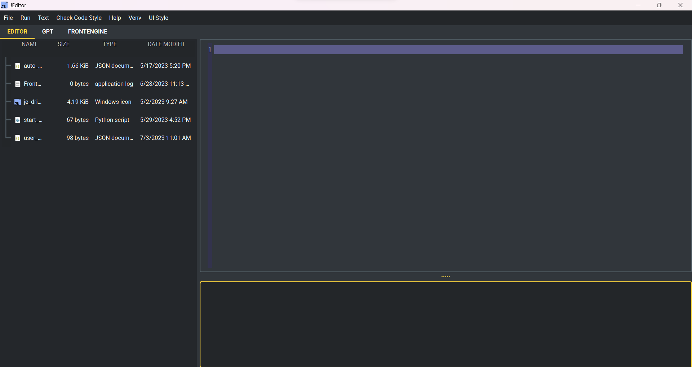

How to use
----

* JEditor is a simple text editor, but it has all the necessary features.
* JEditor is one of the components of ITE, but modularization allows it to be used separately.
* JEditor defaults to using a dark interface as shown below:

* JEditor has the following features:
    * Font change.
    * Font size change.
    * Auto-save (after first save or open).
    * Tree file structure browsing.
    * Save and open files.
    * Python formatting check using yapf.
    * Run python programs.
    * Run shell commands.